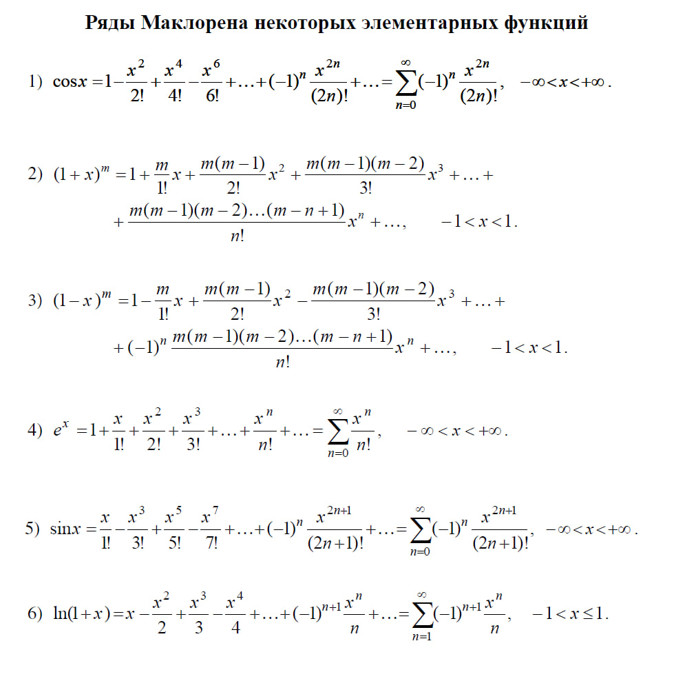

# vvpd5prakk

## Описание программы

Эта программа предоставляет возможность вычисления приблеженный значений следующий математических функций:

1. **exp(x)** - Экспоненциальная функция
2. **sin(x)** - Синус
3. **ln(1 + x)** - Натуральный логарифм
4. **cos(x)** - Косинус
5. **(1 + x)^m** - Биномиальная функция
6. **(1 - x)^m** - Биномиальная функция с отрицательным x

## Установка и запуск программы

### Требования
- **Python 3.13**

### Запуск программы
1. Сохраните файл программы как `math_series_calculator.py`
2. Запустите программу в терминале/командной строке:
    ```bash
   python math_series_calculator.py
   ```

